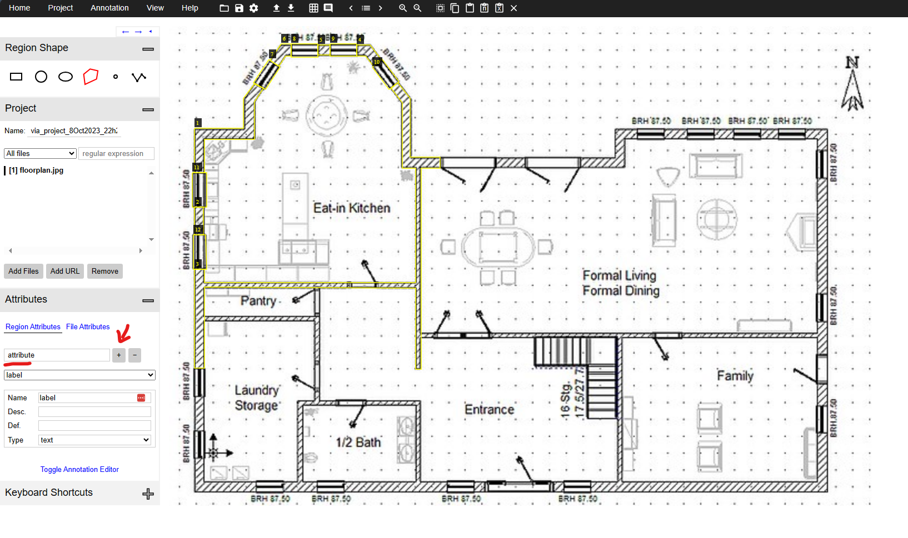
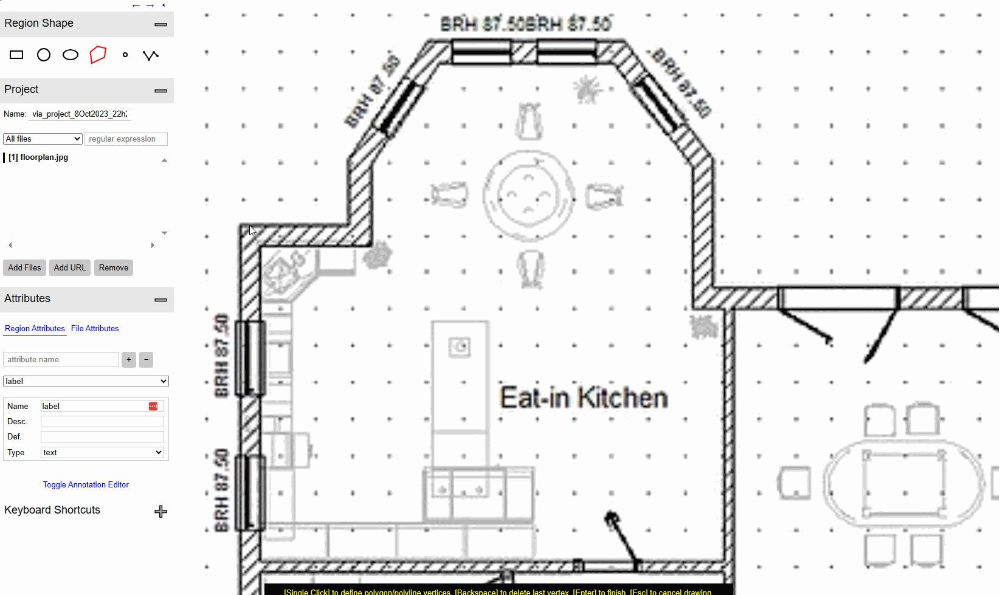

# How to annotate and preprocess your own data?

First, prepare your floorplan images as JPEG files and put under `data/raw_img/` in the project root directory.

Next, open the VIA annotation tool [here](https://www.robots.ox.ac.uk/~vgg/software/via/via.html) or download the offline copy if you prefer.

Add the floorplan images into the annotator by clicking `Project -> Add local files`.

Add two region attributes "label" and "attribute" by typing in the attribute name and clicking "+".

Now you're ready to perform the actual annotation.

In essense: use the region shape tools at the top left to draw the desired polygons, and then update the region attribute table by pressing `spacebar`.
Please see the below gif for an example of a wall instance.

For "label", it can be one of the following classes: `outer,inner,window,door,portal,room,frame`.

Note that entries for "attribute" consists of `id_[pos/neg]`, where `id` is a unique integer for each instance and second part is either `pos` or `neg` depending on if the drawn region mask is positive or negative.
To draw an instance with a hole inside, first draw a positive mask with attribute `id_pos`, followed by drawing the hole with attribute `id_neg`.

To export the annotation, click `Annotation -> Export Annotations (as json)` and save the JSON file as `data/via_annotations.json`

Finally, run the preprocessing script `cd 00_preprocess/; python generate_masks.py`. You should see the processed data along with its visualization in `data/preprocess`.